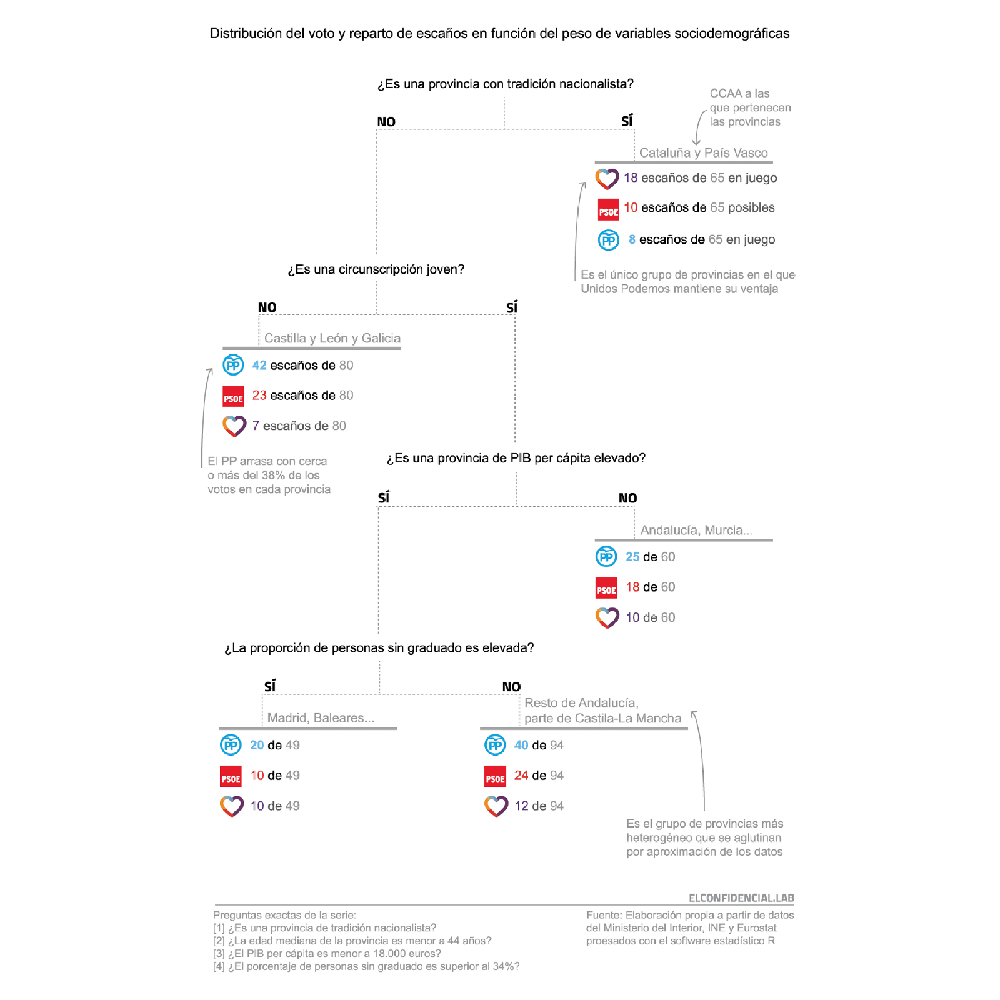

# Classification tree model for the elections

For the 2016 Spanish general, I built a classification tree model that analyzes the sociodemographic variables that influenced the winning party in the Spanish elections. As there were three elections in one year, I decided to use a statistical technique called Classification Tree to show a different perspective of the ballots and provide the reader with new insights. 

A Decision tree is a machine learning model that looks for the best predictors of a certain outcome, in this case, the elections. The outcome conclusions of this tool were published at the Spanish newspaper, El Confidencial.

I worked with a data scientist, [Virginia Peón](https://lab.elconfidencial.com/@vpeon), to design and write the code behind the model. I also selected, gathered ed and structured the different sociodemographic data we used for the analysis, as well as the elections data to run the model. 

We worked in R with the library [rpart](https://cran.r-project.org/web/packages/rpart/rpart.pdf), that allows you to create classification trees, and [rattle](https://rattle.togaware.com/), that presents statistical and visual summaries of data. After creating the model, I refined the classification tree visualization with Illustrator in order to publish it.

This repository contains the code and the training data to build the model. 

Anyone can *steal* the code in order to build his/her own model or take it as a reference. The objective was to make the code as clean as possible to use this repo as a tool to replicate further analysis in the future.

## Reference

#### Story:

The results were published in this analysis of the election at Spanish online newspaper El Confidencial (in Spanish):

[La ilusión cambió de bando: la movilización de los votantes del PP amplió el triunfo de Rajoy](https://www.elconfidencial.com/elecciones-generales/2016-07-02/ilusion-movilizacion-electorado-pp-elecciones-26j-analisis-datos_1226947/)

An explanation of the process is available in this Medium post (in Spanish):

[Así construimos un modelo para conocer qué factores sociodemográficos influyeron en el voto el 20-D y el 26-J](https://lab.elconfidencial.com/as%C3%AD-construimos-un-modelo-para-conocer-qu%C3%A9-factores-sociodemogr%C3%A1ficos-influyeron-en-el-voto-el-20-d-6e5cd298929d)

#### Further reading:

Other classification trees that have been built to analize elections are:

[The election explained by the Times Data Team](https://medium.com/digital-times/the-election-explained-by-the-times-data-team-482d3ab95f5c)

[Decision tree: The Obama-Clinton divide](https://archive.nytimes.com/www.nytimes.com/imagepages/2008/04/16/us/20080416_OBAMA_GRAPHIC.html)

